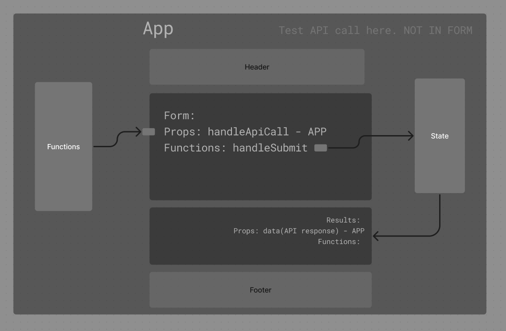
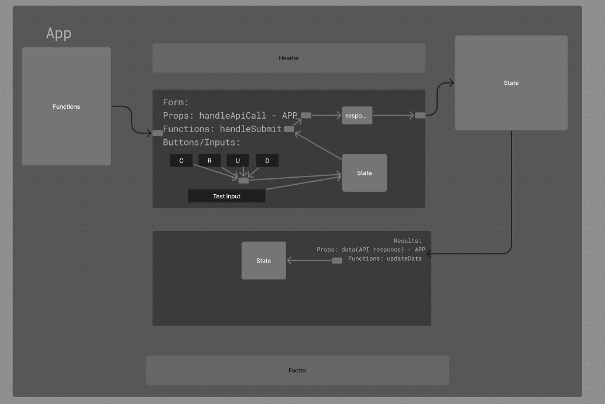
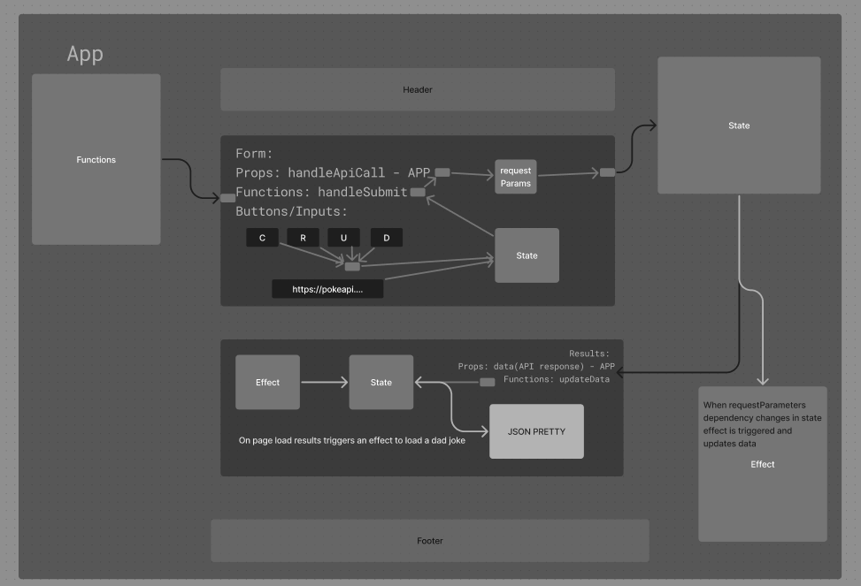

# RESTy React App

## Author: Ethan Storm

## Collaboration: Code Fellows LAB-26, 27, 28

### Resources and Links

- [lab 26 sandbox](https://codesandbox.io/p/github/ShadowDraco/resty/main?workspaceId=362bdf81-89b2-4ef7-a8ac-8d339549b43b)
- 
- 
- 

### GOALS

#### Overview

"Thinking in React" means re-evaluating how you look at a web application: Breaking down it's functional parts, data dependencies, behaviors, and styles into independent, deliverable, re-usable components.

#### Describe and Define

- SASS - Nesting and Variables
- "Component Architecture"
- Application and Component "State"
- Debate/Discuss Libraries vs Frameworks
- Basics of a React App
  - index.html in public (root div)
  - index.js as an untouchable "bootstrap" or "entry point"
  - React Renders into that div
  - JSX is actually javascript but it looks like markup
  - Components can be classes or functions. What gets "returned" gets "rendered"
    - Class - `render() { return(jsx) }`
    - Function - `return(jsx)`
  - Components can load and render each other
  - Components can load their own css

#### **Phase 1: Application Setup**

- Basic React Application
- Scaffolding
- Basic State
- Rendering
- Understand how react functional components work, transform the code base and learn to use sass on a basic level. Begin implementing tests in react!

#### **Phase 2: Application State**

- Basic State
- API calls
- updating data with responses
- Receive user input, connect to a live API, turn APP in to a functional component

#### **Phase 3: Application Effects**

-connecting RESTy to live APIs, fetching and displaying remote data. Our primary focus will be to service GET requests.

- FLOW:
- User enters an API URL.
- Chooses a REST Method.
- Clicks the “Go” button.
- Application fetches data from the URL given, with the method specified.
- Displays the response headers and results separately.
- Both headers and results should be “pretty printed” JSON.
